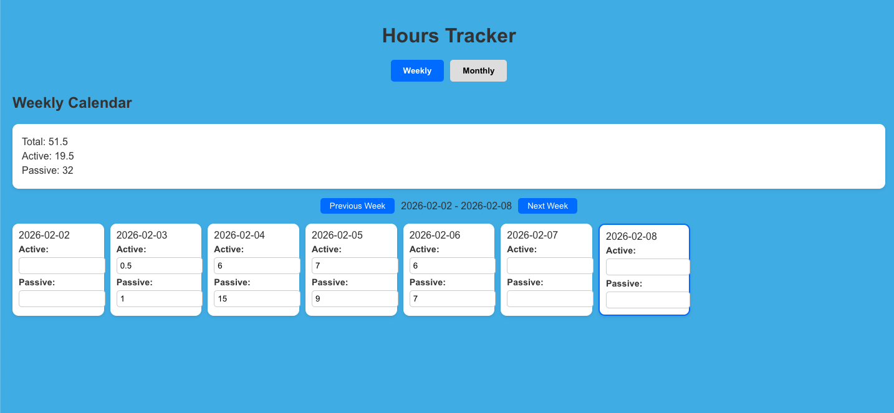
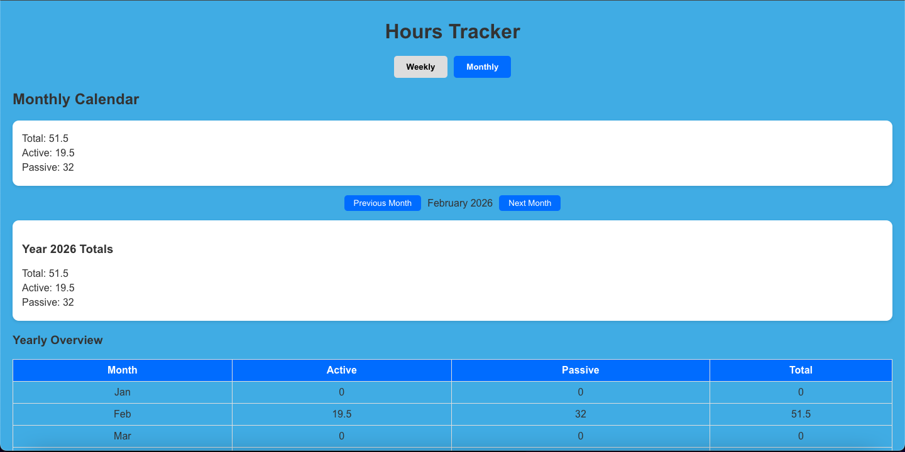
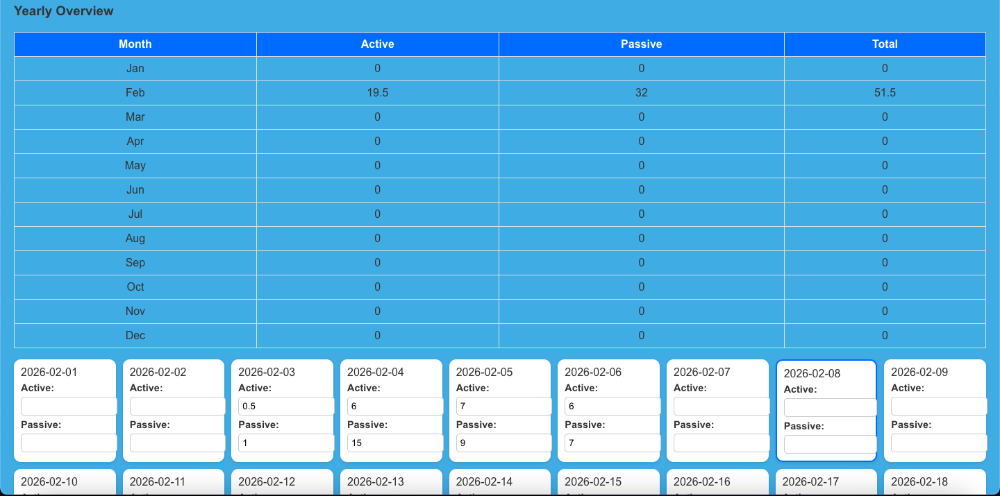
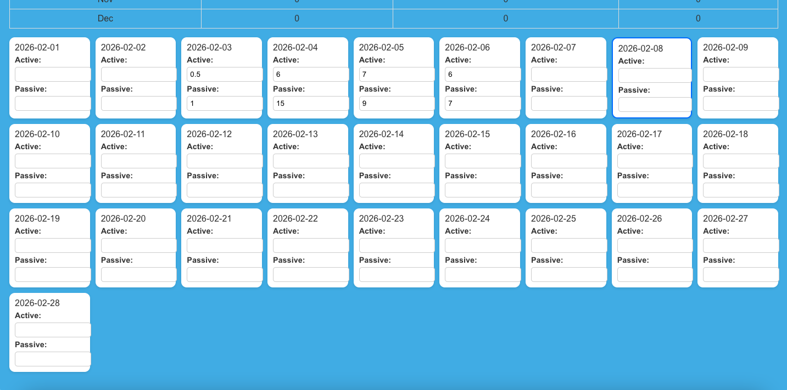

# MERN Hour Tracker

### A full-stack MERN application to help you track and analyze your daily, weekly, and yearly hours. Log active and passive hours for each day and visualize your productivity through weekly and monthly dashboards. The app is user-friendly, allowing you to quickly add, edit, or view your entries.

# Why I Built This

### I made this app while learning Japanese because I wanted a way to store and track my daily active and passive immersion hours. I also wanted all the data in one place so I could generate statistics for each type of activity, providing insights on what I need to focus on more.

### This project is both a learning tool for me and a way to organize and analyze my personal learning habits.

# Features

### Daily Logging: Add your active and passive hours for each day.

### Weekly & Monthly Dashboards: Visualize your progress and trends over time.

### Statistics Tracking:

### Total hours

### Weekly totals

### Yearly totals

### Easy Editing: Quickly update or delete entries.

## Weekly Tracker

## Monthly Tracker

